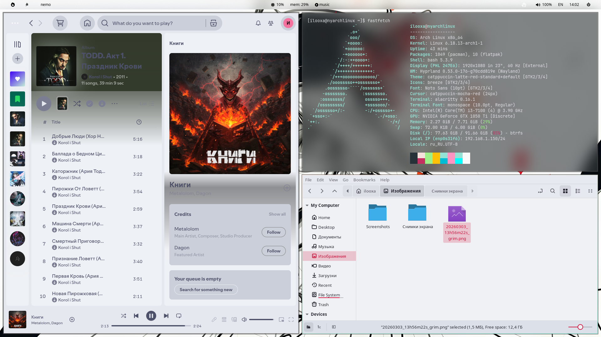

# Hyprland-Hu-Tao-dots
## Screenshots


## How to install
archlinux 
## How to install
* Archlinux
```
sudo pacman -S hyprland hyprpaper mako alacritty waybar wofi ttf-jetbrains-mono ttf-nerd-fonts-symbols ttf-font-awesome nemo playerctl && yay -S catppuccin-cursors-mocha catppuccin-cursors-mocha catppuccin-gtk-theme-mocha wlogout
```
